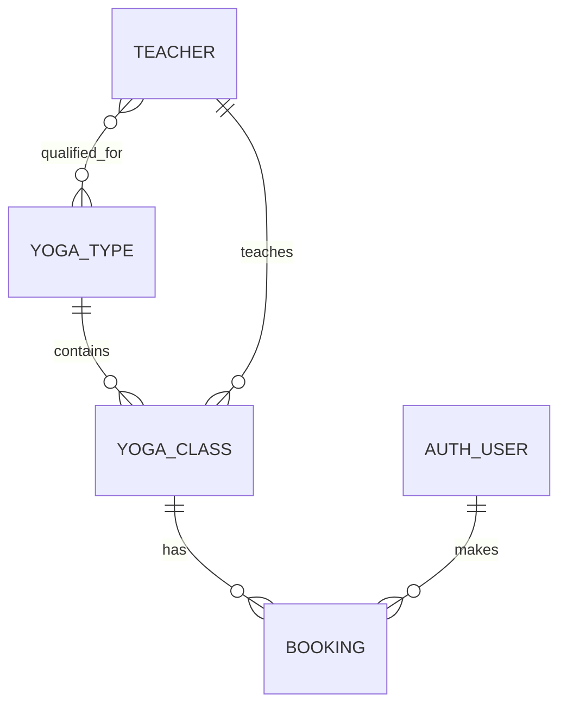

# Yoga Lane - Yoga Booking App

A responsive Django web application for browsing yoga classes, creating student accounts, booking classes through Stripe Checkout, and managing a personal booking dashboard.

## Table of Contents

- [Live Site](#live-site)
- [Validation](#validation)
- [UX Design](#ux-design)
- [Agile Methodology](#agile-methodology)
- [Features](#features)
- [Database Design](#database-design)
- [Technology Stack](#technology-stack)
- [Testing](#testing)
- [Deployment](#deployment)
- [Security](#security)
- [AI Use](#ai-use)
- [Credits](#credits)

---

## Live Site

- [Yogalane Website](https://yogalane-760a26bf11ef.herokuapp.com/)

---

## Validation


## UX Design

### Design Goals

Yoga Lane was designed to be simple, calm, and easy to use on mobile and desktop screens. The application focuses on a clear user journey:

1. Visit the landing page.
2. Browse available yoga classes.
3. Register or log in.
4. Book a class using Stripe test mode.
5. View upcoming and cancelled bookings inside the student dashboard.
6. Upload and manage a profile picture.

### Accessibility and Front-End Quality

The front end uses semantic HTML, Bootstrap 5, and custom CSS to provide a clean, responsive user experience.

Key accessibility and UX choices include:

- Semantic page structure with headings, forms, buttons, navigation, and alerts.
- Responsive layout built with Bootstrap grid, flex utilities, and card components.
- Clear active-state navigation in the main menu.
- Visible form labels, button text, and feedback messages.
- Screen-reader support for current-page indicators using visually hidden text.
- Responsive cards and forms that adapt to smaller screens without losing functionality.
- Consistent styling through shared base templates and custom CSS files.

Custom styling is stored in:

- `static/css/style.css`
- `static/css/profile.css`

### UX Documentation

The final interface was developed from a mobile-first layout plan and implemented directly in Django templates with Bootstrap components.

Note:

- This repository does not currently include standalone wireframe or mockup image files.
- The final implementation reflects the planned user journeys and a consistent booking dashboard layout.

### Screenshots

Add your project screenshots here once they are exported into the repository. Suggested screenshots:

#### Home page


#### Class list page


#### Register / login page


#### Student dashboard with bookings


#### Stripe Checkout success flow


#### Django admin User list


#### Django admin Teacher list


#### Django admin Yoga Type


#### Django admin Yoga Classes list


#### Django admin Yoga Class form


#### Django admin Booking list (read only)


#### Django admin Booking details (read only)


#### Automated test run showing all tests passed


---

## Agile Methodology

The project was developed using an Agile workflow with incremental feature planning and delivery.

Typical user stories included:

- As a visitor, I want to view available classes so I can decide what to book.
- As a visitor, I want to register for an account so I can book classes.
- As a student, I want to log in and see my profile details.
- As a student, I want to upload a profile picture.
- As a student, I want to book a yoga class through Stripe Checkout.
- As a student, I want to see my upcoming and cancelled bookings in my dashboard.
- As a student, I want to cancel a future booking from the dashboard.
- As an admin, I want to manage teachers, classes, and view bookings in read-only mode.

Work was prioritised in small increments:

1. Authentication and registration.
2. Class browsing and filtering.
3. Database models and admin setup.
4. Booking flow and Stripe integration.
5. Student dashboard and profile page.
6. Validation, responsiveness, and deployment configuration.

---

## Features

### Public Features

- Home page with a simple landing layout.
- Class list page showing yoga class cards.
- Filtering by date, yoga type, and teacher.
- Pagination for the class list.
- Register, login, and logout functionality.

### Student Features

- Personal dashboard page.
- Profile picture upload.
- Personal details display.
- Upcoming bookings list.
- Cancelled bookings list.
- Cancel booking action from the dashboard.
- Stripe Checkout booking flow in test mode.

### Admin Features

- Django admin access for managing yoga types, teachers, classes, and bookings.
- Teacher and class management with weekly class generation.
- Booking records visible in admin as read-only so data can be reviewed without CRUD actions.

### Booking and Payment Flow

1. The student clicks Book now on a class card.
2. The app creates a pending booking record.
3. Stripe Checkout opens in test mode.
4. Stripe returns the student to the success URL after payment.
5. The booking is confirmed and appears in the dashboard.
6. The student can later cancel an eligible future booking from the dashboard.

### Known Issue / Planned Improvement

One small area that still needs refinement is the class list page after a booking has been made.

- The booking button should change to a booked state and be disabled once the class has been reserved.
- The remaining capacity for that specific class should update immediately so the available spots are accurate.
- This will make the class list reflect booking activity more clearly and improve the user experience.

---

## Database Design

The application uses a Django database backed by PostgreSQL in production and SQLite during local development.

### Custom Models

The project includes the following core models:

#### `User_Account`

Stores profile data for the student dashboard.

Fields include:

- `role`
- `bio`
- `profile_picture`

#### `Yoga_Type`

Represents a yoga style such as Hatha, Vinyasa, or Yin.

Fields include:

- `title`
- `description`

#### `Teacher`

Stores teacher details and availability.

Fields include:

- `name`
- `surname`
- `slug`
- `email`
- `bio`
- `created_at`
- `updated_at`
- `is_active`
- many-to-many relationship with `Yoga_Type`

#### `Yoga_Class`

Represents a single class session.

Fields include:

- foreign key to `Yoga_Type`
- foreign key to `Teacher`
- `slug`
- `date`
- `start_time`
- `end_time`
- `capacity`
- `created_at`
- `updated_at`
- `is_cancelled`
- `repeats_weekly`
- `price`

#### `Booking`

Stores the booking record for a student.

Fields include:

- foreign key to the active Django auth user model
- foreign key to `Yoga_Class`
- `created_at`
- `cancelled_at`
- `stripe_payment_intent`
- `stripe_checkout_id`
- `amount_paid`
- `status`
- `currency`

### Data Relationships

- One `Yoga_Type` can be linked to many `Yoga_Class` records.
- One `Teacher` can teach many `Yoga_Class` records.
- One `Yoga_Class` can have many `Booking` records.
- One user can have many bookings, but only one booking per class.
- `Teacher` and `Yoga_Type` have a many-to-many relationship.

### Schema Notes

- Slugs are generated automatically for teachers and classes.
- Weekly classes can be generated from the Django admin.
- Teacher deactivation automatically cancels their active classes.
- Booking status choices are used to track pending, confirmed, and cancelled states.
- Migrations were used throughout development to manage schema changes.

### ER Diagram

If you have a saved ERD image, place it here in the repository and link it below.




---

## Technology Stack

### Front End

- HTML5
- CSS3
- Bootstrap 5.3

### Back End

- Python 3.14
- Django 6.0.3
- Gunicorn

### Database and Storage

- PostgreSQL
- SQLite (local development)
- Cloudinary for media storage in production
- WhiteNoise for static file serving in production

### Payments and Utilities

- Stripe Checkout
- `dj-database-url`
- `django-crispy-forms`
- `crispy-bootstrap5`
- Pillow

### Development Tools

- Git
- GitHub
- Heroku

---

## Testing

### Automated Testing

The repository includes Django unit tests for authentication and registration flows in `accounts/tests.py`.

Test coverage currently includes:

- Registration form validation
- Duplicate email rejection
- Successful registration redirect
- Login page form type
- Successful login
- Failed login with incorrect password

Automated test command:

```bash
python manage.py test
```

Current local test run summary:

- 6 tests discovered
- 6 passed

The automated Django test suite currently passes locally.

### Manual Testing

The following user journeys were checked during development:

| Feature                         | Expected Result                                     | Status   |
| ------------------------------- | --------------------------------------------------- | -------- |
| Register a new user             | Account is created and user can log in              | Verified |
| Log in with valid credentials   | User is authenticated and redirected                | Verified |
| Log in with invalid credentials | Error message appears                               | Verified |
| Browse class list               | Upcoming classes are displayed as cards             | Verified |
| Filter classes                  | Results update according to selected filters        | Verified |
| Book a class                    | Stripe Checkout opens and creates a pending booking | Verified |
| Complete Stripe payment         | Booking is confirmed and returned to dashboard      | Verified |
| Cancel a booking                | Booking status changes to cancelled                 | Verified |
| Upload profile picture          | Valid image is accepted and displayed               | Verified |
| Use dashboard on mobile         | Layout remains usable and responsive                | Verified |

### JavaScript Testing

No custom JavaScript was added to the project, so no custom JS test suite was required.

---

## Deployment

### Local Setup

1. Clone the repository.
2. Create and activate a virtual environment.
3. Install dependencies from `requirements.txt`.
4. Create an `env.py` file for local environment variables.
5. Run migrations.
6. Create a superuser if needed.
7. Start the development server.

Example commands:

```bash
python -m venv .venv
.\.venv\Scripts\activate
pip install -r requirements.txt
python manage.py migrate
python manage.py createsuperuser
python manage.py runserver
```

### Required Environment Variables

Local and production environments should provide:

- `SECRET_KEY`
- `DATABASE_URL`
- `STRIPE_SECRET_KEY`
- `STRIPE_PUBLIC_KEY`
- `CLOUDINARY_URL` (for media storage in production)

### Heroku Deployment

The app is configured for cloud deployment with a `Procfile`:

```bash
web: gunicorn yogalane.wsgi
```

Deployment steps:

1. Create a Heroku app.
2. Add the Python buildpack.
3. Add PostgreSQL as the database add-on.
4. Set the config vars listed above.
5. Connect the GitHub repository.
6. Deploy the main branch.
7. Run migrations on the Heroku instance.
8. Confirm the site loads and Stripe booking flow works.

### Deployment Security

- `DEBUG` is set to `False` in production.
- Sensitive values are managed through environment variables.
- Cloudinary credentials are only required when production media storage is enabled.
- Stripe keys are kept out of the source code.

---

## Security

Security considerations implemented in the project include:

- Passwords are handled by Django authentication.
- Registration uses form validation and duplicate email checks.
- Booking creation and cancellation are restricted to authenticated users.
- Dashboard bookings are filtered by the current logged-in user.
- Booking admin is read-only so booking data can be reviewed without being edited from the admin panel.
- Sensitive API keys are stored as environment variables.

---

## AI Use

AI tools were used during development to support the following areas:

- Generating and refining Django view logic for booking, cancellation, and checkout flows.
- Debugging routing, model, and foreign key issues.
- Improving UX decisions for the student dashboard and booking cards.
- Helping shape validation, testing, and deployment documentation.
- Drafting and refining unit test structure and expectations.

The final implementation was reviewed and adapted to match the project structure and requirements.

---

## Credits

- Django documentation
- Bootstrap documentation
- Stripe documentation
- Cloudinary documentation
- Code Institute learning resources

---

## Future Improvements

Possible next steps for the project:

- Add a refund flow for cancelled paid bookings.
- Add waitlist support for fully booked classes.
- Add teacher dashboard tools for class management.
- Add richer booking confirmation emails.
- Add a dedicated wireframe/mockup section with uploaded design assets.
